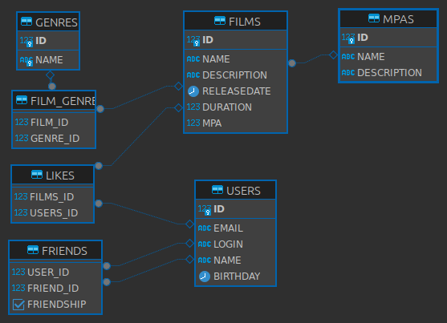

# Filmorate

Filmorate — это социальная платформа, позволяющая пользователям взаимодействовать друг с другом, оставлять отзывы, рекомендовать фильмы и многое другое.

## Основные возможности

- **Управление друзьями**: добавление и удаление друзей для расширения круга общения.
- **Отзывы**: оставление отзывов на фильмы с возможностью оценки.
- **Рекомендации**: получение персонализированных рекомендаций фильмов на основе предпочтений и активности друзей.
- **Лента событий**: отслеживание действий друзей, включая добавление новых фильмов, отзывы и обновления.
- **Поиск фильмов**: поиск фильмов по ключевым словам в названии или описании.
- **Популярные фильмы**: просмотр самых популярных фильмов с фильтрацией по жанрам и годам.
- **Фильмы по режиссерам**: просмотр фильмов, отсортированных по режиссерам.
- **Удаление фильмов и пользователей**: удаление фильмов или пользователей по идентификатору.

## Технологический стек

- **Язык программирования**: Java 21
- **Фреймворк**: Spring Boot
- **Сборка проекта**: Maven
- **База данных**: H2 SQL
- **ORM**: JDBC
- **Логирование**: SLF4J

## Архитектура

Приложение разработано в соответствии с REST-архитектурой на основе Spring Boot.
База данных реализована с использованием H2 SQL и может храниться в виде файла на локальном компьютере.
Обмен данными между базой данных и сервисом осуществляется через JDBC.

## Требования для развёртывания

- JDK 21
- Maven
- Spring Boot

## Установка и запуск

1. Клонируйте репозиторий:

   ```bash
   git clone https://github.com/gigaden/java-filmorate.git
   ```

2. Перейдите в директорию проекта:

   ```bash
   cd java-filmorate
   ```

3. Соберите проект с помощью Maven:

   ```bash
   mvn clean install
   ```

4. Запустите приложение:

   ```bash
   mvn spring-boot:run
   ```

Приложение будет доступно по адресу `http://localhost:8080`.

## ER-диаграмма



